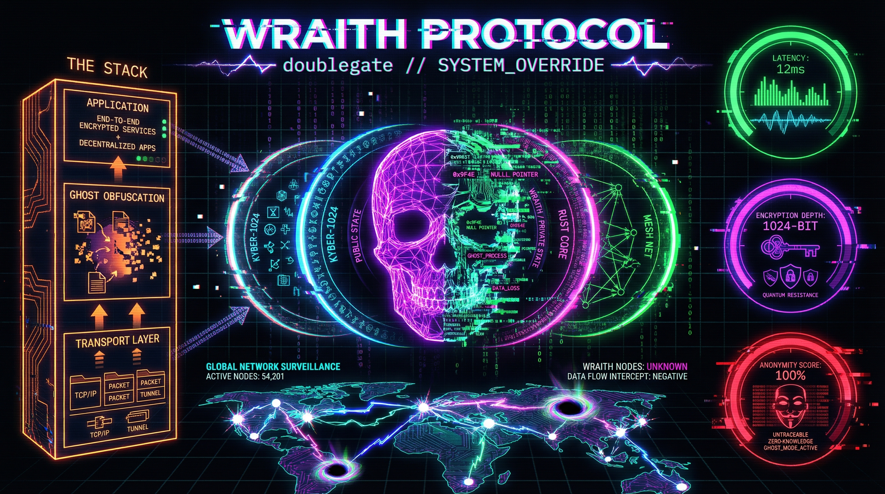
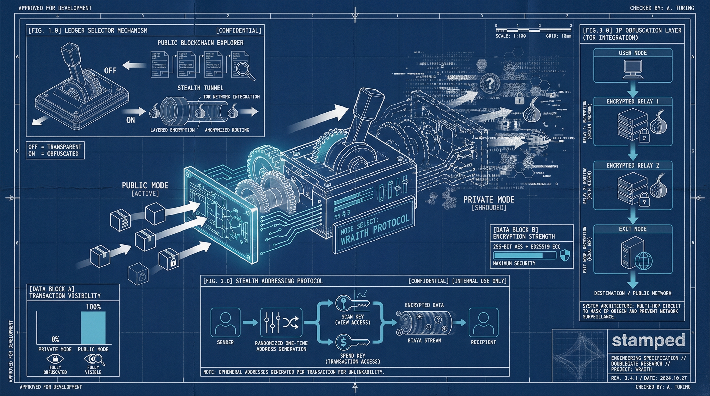

# WRAITH Protocol

**W**ire-speed **R**esilient **A**uthenticated **I**nvisible **T**ransfer **H**andler

A decentralized secure file transfer protocol optimized for high-throughput, low-latency operation with strong security guarantees and traffic analysis resistance.



[](https://github.com/doublegate/WRAITH-Protocol/actions/workflows/ci.yml)
[](https://github.com/doublegate/WRAITH-Protocol/actions/workflows/codeql.yml)
[](https://github.com/doublegate/WRAITH-Protocol/actions/workflows/release.yml)
[](https://github.com/doublegate/WRAITH-Protocol/releases)
[](https://www.rust-lang.org/)
[](https://doc.rust-lang.org/edition-guide/rust-2024/index.html)
[](LICENSE)

## Current Status

**Version:** 0.5.0 (Phase 5 Complete - Discovery & NAT Traversal) | **Phase 6 Ready ✅**

WRAITH Protocol has completed Phases 1-5, delivering a fully functional core protocol, cryptographic layer, high-performance transport implementation, optimization and hardening, comprehensive traffic obfuscation, and complete peer discovery with NAT traversal. The latest release includes AF_XDP kernel bypass with zero-copy I/O, BBR pacing enforcement, io_uring async file I/O, frame validation hardening, complete traffic obfuscation with TLS/WebSocket/DoH mimicry, privacy-enhanced Kademlia DHT, STUN/ICE NAT traversal, and DERP-style relay infrastructure.

**Pre-Phase 5 Technical Debt Review Complete ✅ (2025-11-30):**
- Comprehensive analysis of 15 technical debt items (4 complete, 1 executed, 10 deferred)
- **Zero blocking items for Phase 5** - All critical quality gates passed
- Implementation report documenting all analysis findings
- Phase 5 readiness confirmed across all crates

**Phases 1-5 Complete ✅ (546/789 story points, 69% overall progress)**

**Code Quality Metrics:**
- **Quality Grade:** A (92/100)
- **Technical Debt Ratio:** 14% (well within healthy range)
- **Test Coverage:** 828 tests passing (100% pass rate)
- **Security Vulnerabilities:** Zero
- **Clippy Warnings:** Zero
- **Unsafe Code Documentation:** 100% coverage (40+ SAFETY comments)
- **Documentation:** Comprehensive technical debt tracking (6 files in `to-dos/technical-debt/`)

**Implementation Status:**
- Core workspace: 9 crates (8 active + 1 XDP), ~22,500+ lines of Rust code
- Test coverage: **828 passing tests** (197 wraith-core + 123 wraith-crypto + 24 vectors + 130 wraith-obfuscation unit + 54 wraith-transport + 16 wraith-files + 184 wraith-discovery + 100 doctests)
  - wraith-core: 197 tests (frame parsing with validation hardening, session management, stream multiplexing, BBR congestion control with pacing, path MTU, connection migration)
  - wraith-crypto: 123 tests (Ed25519 signatures, X25519, Elligator2, XChaCha20-Poly1305 AEAD with key commitment, BLAKE3, Noise_XX, Double Ratchet, replay protection, constant-time ops)
  - wraith-transport: 54 tests (AF_XDP zero-copy sockets with batch processing, worker pools, UDP, MTU discovery, NUMA allocation)
  - wraith-obfuscation: 167 tests total (130 unit + 37 doctests: padding engine with 5 modes, timing obfuscation with 5 distributions, TLS 1.3 mimicry, WebSocket framing, DoH tunneling, adaptive profiles)
  - wraith-files: 16 tests total (12 unit + 4 doctests: io_uring async file I/O with registered buffers, chunking, BLAKE3 hashing)
  - wraith-discovery: 184 tests (Kademlia DHT routing, STUN client, ICE candidate gathering, relay client/server/selector, unified discovery manager with 15 integration tests)
  - Integration vectors: 24 tests (cryptographic correctness, full pipeline validation)
  - Doctests: 100 tests (API documentation examples across all crates)
- Benchmarks: 28 criterion benchmarks (frame parsing/building, transport throughput/latency, MTU cache, worker pools, obfuscation operations)
- Performance: 172M frames/sec parsing (~232 GiB/s theoretical throughput), 3.2 GB/s AEAD encryption, 8.5 GB/s BLAKE3 hashing
- Documentation: 63+ files, 45,000+ lines, complete frame type specifications, comprehensive API docs
- CI/CD: GitHub Actions workflows for testing, security scanning, multi-platform releases (Linux x86_64/aarch64/musl, macOS Intel/ARM, Windows x86_64-msvc)
- Security: Dependabot and CodeQL integration, weekly vulnerability scans, RustSec advisory database, cargo-audit
- Code quality: Zero clippy errors, zero unsafe code in cryptographic paths, comprehensive constant-time operations

**Completed Components:**
- ✅ **Phase 1:** Frame encoding/decoding with SIMD acceleration, session state machine, stream multiplexing, BBR congestion control
- ✅ **Phase 2:** Ed25519 signatures, X25519 + Elligator2, XChaCha20-Poly1305 AEAD with key commitment, BLAKE3, Noise_XX handshake, Double Ratchet, replay protection
- ✅ **Phase 3:** AF_XDP zero-copy networking, io_uring async I/O, UDP transport, worker thread pools, NUMA allocation, MTU discovery
- ✅ **Phase 4 Part I:** AF_XDP batch processing (rx_batch/tx_batch), BBR pacing enforcement, io_uring registered buffers, frame validation hardening (reserved stream IDs, offset bounds, payload limits)
- ✅ **Phase 4 Part II:** Complete traffic obfuscation layer - PaddingEngine (5 modes), TimingObfuscator (5 distributions), TLS 1.3 mimicry, WebSocket framing, DNS-over-HTTPS tunneling, adaptive threat-level profiles
- ✅ **Phase 5:** Discovery & NAT Traversal (123 SP) - Transport trait abstraction (AsyncUdpTransport), privacy-enhanced Kademlia DHT with BLAKE3 NodeIds and k-bucket routing, STUN client (RFC 5389) with NAT type detection, ICE candidate gathering with UDP hole punching, DERP-style relay infrastructure (RelayClient, RelayServer, RelaySelector), unified DiscoveryManager with end-to-end peer connection flow
- ✅ **Advanced Features:** Path MTU Discovery, Connection Migration, Cover Traffic Generation, Buffer Pools, XDP packet filtering, 15 documented frame types
- ✅ Comprehensive test suite (828 tests)
- ✅ Performance benchmarks (28 criterion benchmarks)
- ✅ Security documentation (SECURITY.md, TECH-DEBT.md)

**Next: Phase 6 - Integration & End-to-End Testing (98 SP)**
- Full protocol integration and end-to-end workflows
- Comprehensive integration testing suite
- Performance validation and optimization
- Security hardening and penetration testing
- Documentation finalization and API stabilization

## Features

### Performance
- **Wire-Speed Transfers**: 10+ Gbps throughput with AF_XDP kernel bypass
- **Sub-Millisecond Latency**: <1ms packet processing with io_uring
- **Zero-Copy I/O**: Direct NIC-to-application data path via AF_XDP UMEM
- **Batch Processing**: rx_batch/tx_batch APIs for efficient packet handling
- **BBR Congestion Control**: Optimal bandwidth utilization with timer-based pacing
- **Async File I/O**: io_uring with registered buffers for zero-copy file operations

### Security

**Core Security Features:**
- **Ed25519 Digital Signatures**: Identity verification and message authentication
- **Strong Encryption**: XChaCha20-Poly1305 AEAD with key commitment (256-bit security, 192-bit nonce)
- **Key Exchange**: X25519 with Elligator2 encoding for indistinguishability
- **Perfect Forward Secrecy**: Double Ratchet with DH and symmetric ratcheting
- **Mutual Authentication**: Noise_XX handshake pattern (3-message mutual auth)
- **Hashing**: BLAKE3 with HKDF for key derivation

**Advanced Security:**
- **Replay Protection**: 64-bit sliding window bitmap prevents duplicate packet acceptance
- **Key Commitment for AEAD**: BLAKE3-based commitment prevents multi-key attacks
- **Automatic Rekey**: Configurable thresholds (90% default) for time, packets, and bytes
- **Constant-Time Operations**: All cryptographic operations timing side-channel resistant
- **Memory Safety**: Pure Rust implementation with ZeroizeOnDrop on all secret key material
- **Documented Unsafe Code**: Zero unsafe in crypto paths; performance-critical unsafe fully documented with SAFETY comments

### Privacy & Obfuscation

**Traffic Analysis Resistance:**
- **Elligator2 Key Encoding**: X25519 public keys indistinguishable from random bytes
- **Packet Padding**: 5 modes (None, PowerOfTwo, SizeClasses, ConstantRate, Statistical)
  - PowerOfTwo: Round to next power of 2 (~15% overhead)
  - SizeClasses: Fixed size buckets [128, 512, 1024, 4096, 8192, 16384] (~10% overhead)
  - ConstantRate: Always maximum size (~50% overhead, maximum privacy)
  - Statistical: Geometric distribution-based random padding (~20% overhead)
- **Timing Obfuscation**: 5 distributions (None, Fixed, Uniform, Normal, Exponential)
  - Uniform: Random delays within configurable range
  - Normal: Gaussian distribution with mean and standard deviation
  - Exponential: Poisson process simulation for natural traffic patterns
- **Cover Traffic**: Constant, Poisson, and uniform distribution modes

**Protocol Mimicry:**
- **TLS 1.3 Record Layer**: Authentic-looking TLS application data records
  - Content type 23 (application_data), version 0x0303
  - Fake handshake generation (ClientHello, ServerHello, Finished)
  - Sequence number tracking for realistic sessions
- **WebSocket Binary Frames**: RFC 6455 compliant framing
  - Binary frame encoding with FIN bit and opcode 0x02
  - Client masking with random masking keys
  - Extended length encoding (126 for 16-bit, 127 for 64-bit)
- **DNS-over-HTTPS Tunneling**: Payload embedding in DNS queries
  - base64url encoding for query parameters
  - EDNS0 OPT records for payload carrier
  - Query/response packet construction and parsing

**Adaptive Obfuscation:**
- Threat-level-based profile selection (Low, Medium, High, Paranoid)
- Automatic mode selection based on operational context
- Configurable per-session obfuscation strategies

### Decentralization & Discovery

**Privacy-Enhanced Kademlia DHT:**
- **BLAKE3-based NodeId**: 256-bit cryptographic node identifiers
- **K-bucket Routing Table**: XOR-distance-based routing with k=20
- **Peer Discovery**: FIND_NODE queries with distance-based routing
- **Value Storage**: STORE and FIND_VALUE operations for peer announcements
- **Security**: Encrypted peer announcements, rate limiting, Sybil resistance

**NAT Traversal:**
- **STUN Client**: RFC 5389 compliant NAT type detection
  - Full Cone, Restricted Cone, Port-Restricted Cone, Symmetric NAT detection
  - Public IP and port mapping discovery
  - Multiple STUN server support for reliability
- **ICE-like Candidate Gathering**: Host, Server Reflexive, Relayed candidates
- **UDP Hole Punching**: Simultaneous open for NAT traversal
- **Relay Fallback**: Automatic relay selection when direct connection fails

**DERP-style Relay Infrastructure:**
- **RelayClient**: Connect to relay servers, packet forwarding, keepalive
- **RelayServer**: Multi-client support, packet routing, rate limiting
- **RelaySelector**: Intelligent relay selection with latency tracking
  - Selection strategies: LowestLatency, LowestLoad, HighestPriority, Balanced
  - Geographic region filtering
  - Load balancing across relays

**Unified Connection Flow:**
- **DiscoveryManager**: Orchestrates DHT, NAT traversal, and relay infrastructure
- **Connection Types**: Direct, HolePunched, Relayed
- **Automatic Fallback**: DHT lookup → Direct connection → Hole punch → Relay
- **Connection Migration**: Seamless IP address changes with PATH_CHALLENGE/PATH_RESPONSE

## Installation

### Pre-Built Binaries (Recommended)

Download pre-built binaries for your platform from the [releases page](https://github.com/doublegate/WRAITH-Protocol/releases):

**Supported Platforms:**
- Linux x86_64 (glibc and musl)
- Linux aarch64
- macOS x86_64 (Intel)
- macOS aarch64 (Apple Silicon)
- Windows x86_64

```bash
# Linux/macOS
tar xzf wraith-<platform>.tar.gz
chmod +x wraith
./wraith --version

# Windows (PowerShell)
Expand-Archive wraith-x86_64-windows.zip
.\wraith.exe --version
```

All release artifacts include SHA256 checksums for verification.

### Build From Source

**Prerequisites:**
- Rust 1.85+ (Rust 2024 edition)
- Linux 6.2+ (recommended for AF_XDP and io_uring support)
- x86_64 or aarch64 architecture

```bash
# Clone the repository
git clone https://github.com/doublegate/WRAITH-Protocol.git
cd WRAITH-Protocol

# Build all crates
cargo build --release

# Run tests
cargo test --workspace

# The wraith binary will be in target/release/wraith
./target/release/wraith --version
```

## Quick Start

**Note:** WRAITH Protocol is currently in early development (v0.1.0). The CLI interface is scaffolded but not yet functional. The following commands represent the planned interface:

```bash
# Send a file (coming soon)
wraith send document.pdf alice@peer.key

# Receive files (coming soon)
wraith receive --output ./downloads

# Run as daemon (coming soon)
wraith daemon --bind 0.0.0.0:0

# Generate a keypair (coming soon)
wraith keygen --output ~/.wraith/identity.key
```

For current development status, see [ROADMAP.md](to-dos/ROADMAP.md) and [Phase 1 Sprint Plan](to-dos/protocol/phase-1-foundation.md).



## Project Structure

```
WRAITH-Protocol/
├── crates/                      # Rust workspace crates
│   ├── wraith-core/            # Frame encoding, sessions, congestion control
│   ├── wraith-crypto/          # Noise handshake, AEAD, Elligator2, ratcheting
│   ├── wraith-transport/       # AF_XDP, io_uring, UDP sockets
│   ├── wraith-obfuscation/     # Padding, timing, cover traffic, mimicry
│   ├── wraith-discovery/       # DHT, relay, NAT traversal
│   ├── wraith-files/           # Chunking, integrity, transfer state
│   ├── wraith-cli/             # Command-line interface
│   └── wraith-xdp/             # eBPF/XDP programs (Linux-only)
├── docs/                        # Comprehensive documentation
│   ├── architecture/           # Protocol design (5 docs)
│   ├── engineering/            # Development guides (4 docs)
│   ├── integration/            # Embedding & platform support (3 docs)
│   ├── testing/                # Testing strategies (3 docs)
│   ├── operations/             # Deployment & monitoring (3 docs)
│   └── clients/                # Client application docs (37 docs)
│       ├── overview.md         # Client ecosystem overview
│       ├── wraith-transfer/    # P2P file transfer (3 docs)
│       ├── wraith-chat/        # E2EE messaging (3 docs)
│       ├── wraith-sync/        # Backup sync (3 docs)
│       ├── wraith-share/       # File sharing (3 docs)
│       ├── wraith-stream/      # Media streaming (3 docs)
│       ├── wraith-mesh/        # IoT networking (3 docs)
│       ├── wraith-publish/     # Publishing (3 docs)
│       ├── wraith-vault/       # Secret storage (3 docs)
│       ├── wraith-recon/       # Security testing (6 docs)
│       └── wraith-redops/      # Red team ops (6 docs)
├── to-dos/                      # Sprint planning
│   ├── protocol/               # 7 implementation phases
│   ├── clients/                # 10 client application sprints
│   ├── ROADMAP.md              # Project roadmap
│   └── ROADMAP-clients.md      # Comprehensive client roadmap
├── ref-docs/                    # Technical specifications
└── xtask/                       # Build automation
```

## Client Applications

WRAITH Protocol powers a comprehensive ecosystem of secure applications across 3 priority tiers:

### Tier 1: Core Applications (High Priority)

| Client | Description | Status | Story Points |
|--------|-------------|--------|--------------|
| **WRAITH-Transfer** | Direct P2P file transfer with drag-and-drop GUI | Planned | 102 |
| **WRAITH-Chat** | E2EE messaging with Double Ratchet algorithm | Planned | 162 |

### Tier 2: Specialized Applications (Medium Priority)

| Client | Description | Status | Story Points |
|--------|-------------|--------|--------------|
| **WRAITH-Sync** | Decentralized backup synchronization (Dropbox alternative) | Planned | 136 |
| **WRAITH-Share** | Distributed anonymous file sharing (BitTorrent-like) | Planned | 123 |

### Tier 3: Advanced Applications (Lower Priority)

| Client | Description | Status | Story Points |
|--------|-------------|--------|--------------|
| **WRAITH-Stream** | Secure media streaming with live/VOD support (AV1/Opus) | Planned | 71 |
| **WRAITH-Mesh** | IoT mesh networking for decentralized device communication | Planned | 60 |
| **WRAITH-Publish** | Censorship-resistant publishing platform (blogs, wikis) | Planned | 76 |
| **WRAITH-Vault** | Distributed secret storage using Shamir Secret Sharing | Planned | 94 |

### Tier 3: Security Testing (Specialized - Authorized Use Only)

| Client | Description | Status | Story Points |
|--------|-------------|--------|--------------|
| **WRAITH-Recon** | Network reconnaissance & data exfiltration assessment | Planned | 55 |
| **WRAITH-RedOps** | Red team operations platform with C2 infrastructure | Planned | 89 |

**Total Ecosystem:** 10 clients, 1,028 story points, ~70 weeks development timeline.

**Security Testing Notice:** WRAITH-Recon and WRAITH-RedOps require signed authorization and governance compliance. See [Security Testing Parameters](ref-docs/WRAITH-Security-Testing-Parameters-v1.0.md) for authorized use requirements.

See [Client Documentation](docs/clients/overview.md) and [Client Roadmap](to-dos/ROADMAP-clients.md) for comprehensive details.

## Development

### Prerequisites

- **Rust 1.85+** (Rust 2024 edition) - [Install Rust](https://www.rust-lang.org/tools/install)
- **Linux 6.2+** (recommended for AF_XDP and io_uring support)
- **x86_64 or aarch64** architecture
- **clang/LLVM** (optional, for XDP/eBPF compilation)

**Note:** While Linux 6.2+ is recommended for optimal performance with kernel bypass features, WRAITH Protocol includes UDP fallback that works on all platforms.

### Build Commands

```bash
# Development build
cargo build --workspace

# Release build with optimizations
cargo build --release

# Run all tests
cargo test --workspace

# Run lints
cargo clippy --workspace -- -D warnings

# Format code
cargo fmt --all

# Run all CI checks (test + clippy + fmt + doc)
cargo xtask ci

# Generate API documentation
cargo doc --workspace --open

# Run benchmarks (coming soon)
cargo bench --workspace
```

### Cargo Aliases

WRAITH provides convenient cargo aliases (see `.cargo/config.toml`):

```bash
# Run full CI suite
cargo xtci

# Build and open documentation
cargo xtdoc

# Build XDP programs (Linux only, requires eBPF toolchain)
cargo xdbuild
```

### Testing

```bash
# Unit tests
cargo test --lib

# Integration tests
cargo test --test '*'

# Property-based tests
cargo test --features proptest

# Run with coverage
cargo tarpaulin --workspace --out Html
```

### Python Tooling (Optional)

WRAITH Protocol uses Python for auxiliary tasks like YAML linting. A Python virtual environment is provided:

```bash
# Quick health check (commands must be chained with &&)
source .venv/bin/activate && yamllint --version

# Lint GitHub Actions workflows
source .venv/bin/activate && yamllint .github/

# Automated venv setup/repair
bash scripts/venv-setup.sh
```

See [Python Tooling Guide](docs/engineering/python-tooling.md) for detailed documentation.

**Note:** Due to Claude Code's shell behavior, always chain commands with `&&` when using the venv.

## Documentation

### Architecture & Design
- [Protocol Overview](docs/architecture/protocol-overview.md)
- [Layer Design](docs/architecture/layer-design.md)
- [Security Model](docs/architecture/security-model.md)
- [Performance Architecture](docs/architecture/performance-architecture.md)
- [Network Topology](docs/architecture/network-topology.md)

### Development
- [Development Guide](docs/engineering/development-guide.md)
- [Coding Standards](docs/engineering/coding-standards.md)
- [API Reference](docs/engineering/api-reference.md)
- [Dependency Management](docs/engineering/dependency-management.md)
- [Python Tooling Guide](docs/engineering/python-tooling.md)

### Integration
- [Embedding Guide](docs/integration/embedding-guide.md)
- [Platform Support](docs/integration/platform-support.md)
- [Interoperability](docs/integration/interoperability.md)

### Testing & Operations
- [Testing Strategy](docs/testing/testing-strategy.md)
- [Performance Benchmarks](docs/testing/performance-benchmarks.md)
- [Deployment Guide](docs/operations/deployment-guide.md)
- [Monitoring](docs/operations/monitoring.md)

### Specifications
- [Protocol Technical Details](ref-docs/protocol_technical_details.md)
- [Implementation Guide](ref-docs/protocol_implementation_guide.md)

### Client Applications
- [Client Overview](docs/clients/overview.md)
- [Client Roadmap](to-dos/ROADMAP-clients.md)
- Individual client documentation (architecture, features, implementation, integration, testing, usage)

### Project Planning
- [Project Roadmap](to-dos/ROADMAP.md)
- [Client Roadmap](to-dos/ROADMAP-clients.md)
- [Documentation Status](docs/DOCUMENTATION_STATUS.md)

### Technical Debt & Quality
- [Technical Debt Analysis](to-dos/technical-debt/technical-debt-analysis.md) - Comprehensive code quality assessment
- [Technical Debt Action Plan](to-dos/technical-debt/technical-debt-action-plan.md) - Prioritized remediation strategy
- [Technical Debt TODO List](to-dos/technical-debt/technical-debt-todo-list.md) - Actionable tracking checklist
- [Pre-Phase 5 Review Summary](to-dos/technical-debt/pre-phase-5-review-summary.md) - Phase 5 readiness assessment (15 items analyzed)
- [Implementation Report](to-dos/technical-debt/IMPLEMENTATION-REPORT.md) - Detailed findings and recommendations
- [Phase 4 Technical Debt](to-dos/technical-debt/phase-4-tech-debt.md) - Phase 4 technical debt tracking
- **Current Metrics:** Grade A (92/100), 14% debt ratio, 607 tests, zero blocking items for Phase 5

### Security Testing
- [Security Testing Parameters](ref-docs/WRAITH-Security-Testing-Parameters-v1.0.md)
- [WRAITH-Recon Documentation](docs/clients/wraith-recon/)
- [WRAITH-RedOps Documentation](docs/clients/wraith-redops/)

## Roadmap

WRAITH Protocol development follows a structured 7-phase approach spanning 32-44 weeks:

### Protocol Development (789 Story Points)

| Phase | Focus | Duration | Story Points | Status |
|-------|-------|----------|--------------|--------|
| **Phase 1** | Foundation & Core Types | 4-6 weeks | 89 | ✅ **Complete** |
| **Phase 2** | Cryptographic Layer | 4-6 weeks | 102 | ✅ **Complete** |
| **Phase 3** | Transport & Kernel Bypass | 6-8 weeks | 156 | ✅ **Complete** |
| **Phase 4** | Optimization & Hardening (Part I) | 2-3 weeks | 76 | ✅ **Complete** |
| **Phase 5** | Discovery & NAT Traversal | 5-7 weeks | 123 | ✅ **Complete** |
| **Phase 6** | Integration & Testing | 4-5 weeks | 98 | 🔄 Next |
| **Phase 7** | Final Hardening & Optimization | 6-8 weeks | 145 | Planned |

**Progress:** 546/789 story points delivered (69% complete)

### Client Applications (1,028 Story Points)

10 client applications across 3 priority tiers, including:
- **Tier 1:** WRAITH-Transfer (P2P file transfer), WRAITH-Chat (E2EE messaging)
- **Tier 2:** WRAITH-Sync (backup sync), WRAITH-Share (distributed sharing)
- **Tier 3:** WRAITH-Stream, WRAITH-Mesh, WRAITH-Publish, WRAITH-Vault
- **Security Testing:** WRAITH-Recon, WRAITH-RedOps (authorized use only)

See [ROADMAP.md](to-dos/ROADMAP.md) and [Client Roadmap](to-dos/ROADMAP-clients.md) for detailed planning.

## Performance Targets

| Metric | Target | Notes |
|--------|--------|-------|
| Throughput (10 GbE) | >9 Gbps | AF_XDP with zero-copy |
| Throughput (1 GbE) | >950 Mbps | With encryption |
| Handshake Latency | <50 ms | LAN conditions |
| Packet Latency | <1 ms | NIC to application |
| Memory per Session | <10 MB | Including buffers |
| CPU @ 10 Gbps | <50% | 8-core system |

## CI/CD Infrastructure

WRAITH Protocol uses comprehensive automated workflows for quality assurance and releases:

### Continuous Integration
- **Testing:** Automated test suite on every push and pull request
- **Code Quality:** Clippy linting and rustfmt formatting checks
- **Documentation:** Automated doc generation and link validation
- **MSRV:** Minimum Supported Rust Version (1.85) verification

### Security Scanning
- **Dependabot:** Automated dependency updates with security prioritization
- **CodeQL:** Static analysis for security vulnerabilities
- **cargo-audit:** RustSec advisory database scanning
- **Gitleaks:** Secret scanning with false positive suppression
- **Weekly Scans:** Automated security checks every Monday

### Release Automation
- **Multi-Platform Builds:** 6 platform targets (Linux x86_64/aarch64, macOS Intel/ARM, Windows)
- **Artifact Generation:** Automated binary builds with SHA256 checksums
- **GitHub Releases:** Automatic release creation from version tags
- **Changelog Integration:** Automated release notes from CHANGELOG.md

See [CI Workflow](.github/workflows/ci.yml), [CodeQL Workflow](.github/workflows/codeql.yml), and [Release Workflow](.github/workflows/release.yml) for configuration details.

## Security

WRAITH Protocol is designed with security as a core principle:

### Cryptographic Suite

| Function | Algorithm | Security Level | Features |
|----------|-----------|----------------|----------|
| **Signatures** | Ed25519 | 128-bit | Identity verification, ZeroizeOnDrop |
| **Key Exchange** | X25519 | 128-bit | ECDH on Curve25519 |
| **Key Encoding** | Elligator2 | Traffic analysis resistant | Indistinguishable from random |
| **AEAD** | XChaCha20-Poly1305 | 256-bit key, 192-bit nonce | Key-committing, constant-time |
| **Hash** | BLAKE3 | 128-bit collision resistance | Tree-parallelizable, faster than SHA-3 |
| **KDF** | HKDF-BLAKE3 | 128-bit | Context-separated key derivation |
| **Handshake** | Noise_XX_25519_ChaChaPoly_BLAKE2s | Mutual auth | Identity hiding, forward secrecy |
| **Ratcheting** | Double Ratchet | Forward & post-compromise security | Symmetric per-packet + DH periodic |
| **Replay Protection** | 64-bit sliding window | DoS resistant | Constant-time bitmap operations |

### Security Features

**Cryptographic Guarantees:**
- **Forward Secrecy:** Double Ratchet with independent symmetric and DH ratchets
- **Post-Compromise Security:** DH ratchet heals from key compromise
- **Replay Protection:** 64-bit sliding window bitmap with constant-time operations
- **Key Commitment:** BLAKE3-based AEAD key commitment prevents multi-key attacks
- **Automatic Rekey:** Time-based (90% threshold), packet-count-based, byte-count-based triggers

**Traffic Analysis Resistance:**
- **Elligator2 Key Encoding:** X25519 public keys indistinguishable from random
- **Cover Traffic Generation:** Constant, Poisson, and uniform distribution modes
- **Padding:** Configurable padding modes for traffic shape obfuscation
- **Protocol Mimicry:** TLS, WebSocket, DNS-over-HTTPS wrappers

**Implementation Security:**
- **Memory Safety:** Rust with zero unsafe code in cryptographic paths
- **ZeroizeOnDrop:** Automatic zeroization of all secret key material
- **Constant-Time Operations:** Side-channel resistant implementations for all critical paths
- **SIMD Acceleration:** SSE2/NEON optimized frame parsing with security validation
- **Buffer Pools:** Pre-allocated buffers reduce allocation overhead without compromising security
- **Unsafe Code Audit:** 100% documentation coverage with SAFETY comments on all 40+ unsafe blocks
  - All `unsafe impl Send/Sync` implementations documented and justified
  - Thread safety analysis for kernel bypass operations
  - Safety invariants documented for UMEM, io_uring, CPU affinity operations

**Validation:**
- **Test Coverage:** 607 tests covering security-critical paths (110 increase from Phase 4)
- **Integration Vectors:** 24 integration tests validating cryptographic correctness
- **Integration Tests:** 15 tests for session crypto and frame encryption
- **Obfuscation Tests:** 167 tests (130 unit + 37 doctests) for traffic analysis resistance
- **Property-Based Tests:** proptest for frame validation fuzzing
- **Automated Security Scanning:** Dependabot, CodeQL, RustSec advisories, cargo-audit weekly scans

### Reporting Vulnerabilities

For security issues, please see [SECURITY.md](SECURITY.md) for our security policy and responsible disclosure process.

## Getting Involved

WRAITH Protocol is in active development and we welcome contributions of all kinds:

### For Developers
- **Phase 1 Implementation:** Help complete the core protocol foundation (session state machine, stream multiplexing)
- **Testing:** Write unit tests, integration tests, and property-based tests
- **Documentation:** Improve API docs, add examples, clarify specifications
- **Code Review:** Review pull requests and provide feedback

### For Security Researchers
- **Protocol Review:** Analyze cryptographic design and security properties
- **Penetration Testing:** Test implementations for vulnerabilities (coordinated disclosure)
- **Formal Verification:** Assist with formal proofs of security properties

### For Writers
- **Technical Writing:** Improve documentation clarity and completeness
- **Tutorials:** Create getting-started guides and usage examples
- **Translations:** Translate documentation to other languages

### Current Focus Areas
1. ✅ **Phase 1 Complete** - Core protocol foundation (197 tests, 172M frames/sec, SIMD acceleration)
2. ✅ **Phase 2 Complete** - Cryptographic layer (123 tests, full security suite with Ed25519)
3. ✅ **Phase 3 Complete** - Transport & kernel bypass (54 tests, AF_XDP, io_uring, worker pools, NUMA)
4. ✅ **Phase 4 Part I Complete** - Optimization & hardening (AF_XDP batch processing, BBR pacing, io_uring registered buffers, frame validation)
5. ✅ **Phase 4 Part II Complete** - Obfuscation & stealth (167 tests, 5 padding modes, 5 timing distributions, TLS/WebSocket/DoH mimicry, adaptive profiles)
6. ✅ **Phase 5 Complete** - Discovery & NAT traversal (184 tests, Kademlia DHT, STUN/ICE, relay infrastructure, unified DiscoveryManager)
7. ✅ **Advanced Security Features** - Replay protection, key commitment, automatic rekey, reserved stream ID validation, constant-time operations
8. ✅ **Performance Optimizations** - SIMD frame parsing, buffer pools, fixed-point BBR arithmetic, lazy stream initialization, zero-copy batch processing
9. ✅ **Path MTU Discovery** - Complete PMTUD implementation with binary search probing
10. ✅ **Connection Migration** - PATH_CHALLENGE/PATH_RESPONSE with RTT measurement
11. ✅ **Traffic Obfuscation** - Complete padding engine, timing obfuscator, protocol mimicry (TLS 1.3, WebSocket, DoH), traffic shaper
12. ✅ **Cross-Platform Support** - Windows x86_64-msvc compatibility, platform-specific RawFd handling, MSRV 1.85 build fixes
13. **Next: Phase 6** - Integration & end-to-end testing (protocol integration, performance validation, security hardening, API stabilization)
14. Maintain test coverage (current: 828 tests, target: maintain 80%+ coverage)

See [ROADMAP.md](to-dos/ROADMAP.md) for detailed sprint planning and story point estimates.

## Contributing

We welcome contributions! Please see [CONTRIBUTING.md](CONTRIBUTING.md) for comprehensive guidelines.

### Quick Start for Contributors

1. Fork the repository
2. Create a feature branch (`git checkout -b feature/amazing-feature`)
3. Make your changes with tests
4. Run CI checks locally (`cargo xtask ci`)
5. Commit your changes (`git commit -m 'feat: add amazing feature'`)
6. Push to the branch (`git push origin feature/amazing-feature`)
7. Open a Pull Request

### Contribution Requirements
- Follow Rust coding standards (rustfmt, clippy)
- Add tests for new functionality
- Update documentation (API docs, CHANGELOG.md)
- Sign commits (optional but encouraged)
- Follow [Conventional Commits](https://www.conventionalcommits.org/) format

## License

Licensed under the MIT License. See [LICENSE](LICENSE) for details.

## Acknowledgments

WRAITH Protocol builds on the work of many excellent projects and technologies:

### Protocol Inspirations
- [Noise Protocol Framework](https://noiseprotocol.org/) - Cryptographic handshake patterns
- [WireGuard](https://www.wireguard.com/) - Design philosophy: simplicity and performance
- [QUIC](https://quicwg.org/) - Connection migration and modern transport
- [libp2p](https://libp2p.io/) - DHT and NAT traversal patterns
- [Signal Protocol](https://signal.org/docs/) - Double ratchet algorithm

### Cryptographic Libraries
- [RustCrypto](https://github.com/RustCrypto) - ChaCha20-Poly1305, X25519, BLAKE3 implementations
- [Snow](https://github.com/mcginty/snow) - Noise Protocol Framework for Rust
- [dalek-cryptography](https://github.com/dalek-cryptography) - Ed25519 and X25519

### Performance Technologies
- [AF_XDP](https://www.kernel.org/doc/html/latest/networking/af_xdp.html) - Kernel bypass networking
- [io_uring](https://kernel.dk/io_uring.pdf) - Efficient async I/O
- [eBPF/XDP](https://ebpf.io/) - In-kernel packet processing

## Links

- **Repository:** [github.com/doublegate/WRAITH-Protocol](https://github.com/doublegate/WRAITH-Protocol)
- **Documentation:** [docs/](docs/)
- **Issue Tracker:** [GitHub Issues](https://github.com/doublegate/WRAITH-Protocol/issues)
- **Discussions:** [GitHub Discussions](https://github.com/doublegate/WRAITH-Protocol/discussions)
- **Security Policy:** [SECURITY.md](SECURITY.md)
- **Changelog:** [CHANGELOG.md](CHANGELOG.md)
- **Roadmap:** [ROADMAP.md](to-dos/ROADMAP.md)

---

**WRAITH Protocol** - *Secure. Fast. Invisible.*

**Status:** Phase 5 Complete (v0.5.0), Phase 6 Ready ✅ | **License:** MIT | **Language:** Rust 2024 | **Tests:** 828 | **Quality:** Grade A (92/100), 14% debt ratio, 100% unsafe docs, 69% protocol complete (546/789 SP)
