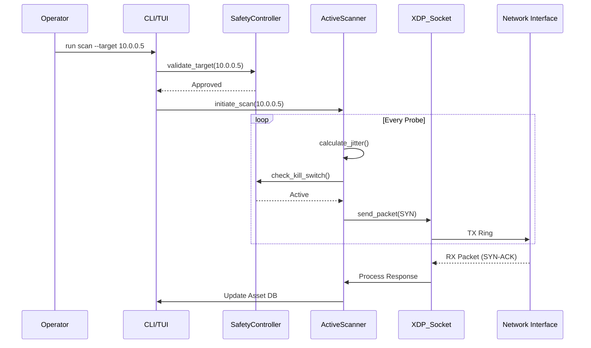

# WRAITH-Recon Reference Architecture

**Document Version:** 1.3.0 (Technical Deep Dive)
**Last Updated:** 2025-11-29
**Classification:** Reference Architecture
**Governance:** See [Security Testing Parameters](../../../ref-docs/WRAITH-Security-Testing-Parameters-v1.0.md)

---

## 1. Executive Summary

WRAITH-Recon is a specialized network reconnaissance and data exfiltration assessment platform designed for authorized security testing. Unlike traditional tools that rely on standard OS networking stacks, WRAITH-Recon leverages **kernel-bypass networking (AF_XDP)** and **WRAITH Protocol Obfuscation** to perform operations that are invisible to standard thresholds, resilient in contested environments, and accurate in mapping network defenses.

It serves two primary operational goals:
1.  **Reconnaissance:** Enumerating assets and mapping topologies without triggering IDS/IPS alerts.
2.  **Exfiltration Assessment:** Validating Data Loss Prevention (DLP) and egress filtering controls through sophisticated protocol mimicry.

**Authorized Use Cases Only:**
- Contracted penetration testing engagements.
- Red team exercises with executive authorization.
- Security research in isolated laboratory environments.

---

## 2. System Architecture

### 2.1 Architecture Overview (High-Level)

The system is divided into three planes: Control, Analysis, and Data.

```mermaid
graph TD
    subgraph "Control Plane (User Space)"
        CLI[CLI / TUI Dashboard]
        Gov[Governance & Safety Controller]
        Log[Tamper-Evident Audit Logger]
    end

    subgraph "Analysis Plane"
        AssetDB[In-Memory Asset Database]
        Fingerprint[OS/Service Fingerprinter]
        PathMap[Egress Path Mapper]
    end

    subgraph "Data Plane (Kernel Bypass)"
        XDP_Prog[eBPF/XDP Filter Program]
        XDP_Sock[AF_XDP Socket (UMEM)]
        Mimic[Protocol Mimicry Engine]
        Shaper[Traffic Shaper / Jitter]
    end

    CLI --> Gov
    Gov --> Log
    Gov --> XDP_Sock
    
    XDP_Sock <--> NIC[Network Interface Card]
    XDP_Sock --> Mimic
    Mimic --> Shaper
    
    XDP_Sock --> AssetDB
    AssetDB --> Fingerprint
```

### 2.2 Component Descriptions

#### A. Governance & Safety Controller (The "Root of Trust")
*   **Purpose:** Enforce engagement boundaries and maintain accountability. It acts as the gatekeeper for all operations.
*   **Mechanism:**
    *   **Cryptographic Authorization:** Requires a signed JWT-like token (RoE Blob) to initialize.
    *   **Scope Enforcement:** Restricts operations to authorized CIDRs and Domains.
    *   **Kill Switch:** Listens on a dedicated channel for a signed "HALT" signal to instantly drop all AF_XDP references.
    *   **Watchdog:** Monitors system time to enforce engagement windows.

#### B. Reconnaissance Module (Passive & Active)
*   **Passive Engine (Zero-Touch):**
    *   Uses AF_XDP to read raw frames from the NIC RX queue.
    *   **BPF Filter:** Discards irrelevant traffic kernel-side.
    *   **Analysis:** Performs TTL analysis, TCP Window fingerprinting, and passive service mapping.
*   **Active Engine (Ghost Probe):**
    *   **Stateless Scanning:** Tracks connection state in a compact hash map, bypassing the OS TCP stack.
    *   **Inverse Mapping:** Sends "Reply" packets (ACK, RST) to solicit errors from firewalls.
    *   **Fragmented Probes:** Sends IP fragments to test reassembly buffers.

#### C. Transfer & Exfiltration Module
*   **Purpose:** Evaluate data movement controls by attempting authorized transfers.
*   **Mimicry Engine:** Wraps WRAITH frames in valid protocol headers (DNS, ICMP, HTTPS/TLS).
*   **Traffic Shaper:** Adjusts Inter-Arrival Time (IAT) and Packet Size Distribution (PSD) to match legitimate profiles (e.g., "Spotify Stream").
*   **Chunking:** Uses `wraith-files` to split data for multi-path exfiltration.

---

## 3. WRAITH Protocol Integration

### 3.1 Cryptographic Transport Layer

WRAITH-Recon leverages the full WRAITH cryptographic suite for secure reconnaissance operations:

**Algorithm Suite:**
| Function | Algorithm | Security Level | Application |
|----------|-----------|----------------|-------------|
| Key Exchange | X25519 | 128-bit | Secure channel establishment |
| Key Encoding | Elligator2 | N/A | Traffic indistinguishability |
| AEAD | XChaCha20-Poly1305 | 256-bit key, 128-bit auth | Frame encryption |
| Hash | BLAKE3 | 128-bit collision resistance | Integrity verification |
| KDF | HKDF-BLAKE3 | 128-bit | Session key derivation |

**Noise_XX Handshake:**
- **Phase 1:** Initiator sends Elligator2-encoded ephemeral key (96 bytes)
- **Phase 2:** Responder sends ephemeral + encrypted static key (128 bytes)
- **Phase 3:** Initiator sends encrypted static key (80 bytes)
- **Result:** Mutually authenticated, forward-secret session

**Session Key Derivation:**
```rust
// After handshake, derive transport keys
let prk = HKDF_Extract(salt: "wraith-v1", ikm: DH_outputs);
let tx_key = HKDF_Expand(prk, "recon-tx", 32);
let rx_key = HKDF_Expand(prk, "recon-rx", 32);
let conn_id = HKDF_Expand(prk, "connection-id", 8);
```

### 3.2 Wire Protocol Details

**Outer Packet Structure (Before Decryption):**
```
├─ Connection ID (8 bytes) - Derived during handshake
├─ Encrypted Payload (variable) - AEAD ciphertext
└─ Authentication Tag (16 bytes) - Poly1305 MAC
Total overhead: 24 bytes minimum
```

**Inner Frame Structure (Post-Decryption):**
```
├─ Nonce (8 bytes) - Session salt || Packet counter
├─ Frame Type (1 byte) - See frame types below
├─ Flags (1 byte) - SYN, FIN, ACK, PRI, CMP
├─ Stream ID (2 bytes) - Logical channel identifier
├─ Sequence Number (4 bytes) - Per-stream ordering
├─ File Offset (8 bytes) - For data frames
├─ Payload Length (2 bytes) - Actual payload size
├─ Reserved (2 bytes) - Future use
├─ Payload Data (variable) - Recon data
└─ Padding (variable) - Random obfuscation
Header size: 28 bytes fixed
```

**Frame Types Used in Reconnaissance:**
| Type | Value | Usage |
|------|-------|-------|
| DATA | 0x01 | Asset discovery data |
| ACK | 0x02 | Acknowledge scanned hosts |
| CONTROL | 0x03 | Scan configuration |
| PING/PONG | 0x05/0x06 | RTT measurement |
| PAD | 0x08 | Cover traffic |
| PATH_CHALLENGE | 0x0E | NAT traversal probes |

### 3.3 Transport Layer Integration

**wraith-transport Crate Integration:**
```rust
use wraith_transport::{Transport, TransportConfig};
use wraith_crypto::{NoiseSession, HandshakePattern};

// Configure kernel-bypass transport
let config = TransportConfig {
    mode: TransportMode::AfXdp,
    bind_addr: "0.0.0.0:0".parse().unwrap(),
    buffer_size: 8192,
    xdp_flags: XdpFlags::SKB_MODE,
};

let transport = Transport::new(config)?;
```

**AF_XDP Configuration for High-Speed Scanning:**
- **UMEM Size:** 64MB (32,768 frames @ 2048 bytes)
- **Ring Sizes:** Fill: 4096, RX: 4096, TX: 4096, Completion: 4096
- **Zero-Copy:** Direct NIC-to-userspace via DMA
- **Batch Processing:** Process up to 64 packets per poll

**io_uring Integration for Asset Data:**
```rust
use io_uring::{opcode, types};

// Async write discovered assets
let write_op = opcode::Write::new(
    types::Fd(db_file.as_raw_fd()),
    asset_buffer.as_ptr(),
    asset_size
).build();

ring.submission().push(&write_op)?;
ring.submit()?;
```

### 3.4 Obfuscation Layer Integration

**Elligator2 Key Encoding:**
- All ephemeral keys during scans appear as uniform random 32-byte strings
- ~50% of generated keys are encodable (acceptable retry rate)
- High bit randomized for additional entropy

**Packet Padding Strategy:**
```rust
pub enum PaddingMode {
    Performance,  // Minimal (next size class)
    Privacy,      // Random selection
    Stealth,      // Match HTTPS distribution
}

// Padding classes: 64B, 256B, 512B, 1024B, 1472B, 8960B
```

**Timing Obfuscation for Scans:**
```rust
// Exponential distribution for stealth scanning
let delay_ms = -5.0 * random::<f64>().ln();
sleep(Duration::from_millis(delay_ms as u64)).await;
```

**Protocol Mimicry Profiles:**
- **TLS Wrapper:** WRAITH frames wrapped in valid TLS 1.3 Application Data records
- **WebSocket:** Binary WebSocket frames with proper masking
- **DNS-over-HTTPS:** Recon queries encoded as DoH TXT record lookups

### 3.5 Ratcheting Schedule

**Symmetric Ratchet (Every Packet):**
```rust
// After each scan packet
chain_key_next = BLAKE3(chain_key_current || 0x01);
message_key = BLAKE3(chain_key_current || 0x02);
// Immediate zeroization
zeroize(chain_key_current);
zeroize(message_key);
```

**DH Ratchet (Time/Volume Triggered):**
- Trigger: Every 2 minutes OR 1,000,000 packets
- Action: Generate new ephemeral key, perform DH, derive new chain key
- Security: Forward secrecy for long-duration reconnaissance

## 3. Operational Workflow

```
┌──────────────────────────────────────────────────────────────────────────┐
│                        Operational Workflow                              │
├──────────────────────────────────────────────────────────────────────────┤
│                                                                          │
│  [1. Authorization]                                                      │
│         │                                                                │
│         │  Load signed RoE, verify engagement parameters                 │
│         ▼                                                                │
│  [2. Scope Validation]                                                   │
│         │                                                                │
│         │  Configure target whitelist, time boundaries, BPF Filters      │
│         ▼                                                                │
│  [3. Passive Reconnaissance]                                             │
│         │                                                                │
│         │  Promiscuous capture, Asset DB population, Path Analysis       │
│         ▼                                                                │
│  [4. Path Selection & Active Probing]                                    │
│         │                                                                │
│         │  Choose transfer channels, run Stealth Scans                   │
│         ▼                                                                │
│  [5. Transfer Execution (Exfil Test)]                                    │
│         │                                                                │
│         │  Attempt data movement via Mimicry Profiles                    │
│         ▼                                                                │
│  [6. Result Collection]                                                  │
│         │                                                                │
│         │  Record success/failure, control effectiveness                 │
│         ▼                                                                │
│  [7. Reporting & Cleanup]                                                │
│         │                                                                │
│         └──▶ Generate Audit Logs, Flush UMEM, Remove Artifacts           │
│                                                                          │
└──────────────────────────────────────────────────────────────────────────┘
```

---

## 4. Data Flow & Pipelines

### 4.1 Passive Capture Pipeline
1.  **NIC RX:** Packet arrives at interface.
2.  **XDP Hook:** eBPF program checks if packet matches "Interest Filter".
3.  **XDP_REDIRECT:** If interesting, redirect to AF_XDP socket.
4.  **User Space Poll:** `io_uring` wakes up the Recon thread.
5.  **Batch Process:** Process batch of 64 frames via Zero-Copy parsers.
6.  **Asset Update:** Update `AssetDB` (Create node, add edge, update timestamp).
7.  **Frame Release:** Mark UMEM descriptor as free.

### 4.2 Exfiltration Pipeline
1.  **Source:** Synthetic Data Generator (PII generator).
2.  **Chunker:** `wraith-files` splits data.
3.  **Encoder:** `wraith-obfuscation` encrypts and encodes chunk (e.g., Base64 for DNS).
4.  **Transport Selection:** Strategy selection (Round-Robin, Cost-Based).
5.  **Shaper:** Holds packet in Jitter Queue to match timing profile.
6.  **TX:** Push to AF_XDP TX Ring.

---

## 5. Detection Considerations

To support defensive improvement, WRAITH-Recon operations produce detectable artifacts if controls are effective:

### Network Indicators
| Indicator Type | Description | Detection Approach |
|----------------|-------------|-------------------|
| **Connection Patterns** | Periodic beaconing intervals | Statistical analysis (Entropy) |
| **Traffic Volume** | Unusual egress data volumes | Baseline deviation |
| **Protocol Anomalies** | Mismatched protocol behaviors (e.g., DNS TXT size) | Deep Packet Inspection (DPI) |
| **Timing** | Perfect interval regularity (if jitter disabled) | Heuristic analysis |

### Endpoint Indicators
| Indicator Type | Description | Detection Approach |
|----------------|-------------|-------------------|
| **Process Behavior** | Unusual process network activity (AF_XDP binding) | EDR behavioral rules |
| **Memory Patterns** | Data aggregation in memory | Memory analysis |

---

## 6. Audit and Accountability

### 6.1 Logging Requirements
All operations must produce tamper-evident logs:
*   **Command Log:** All operator commands (Signed, timestamped).
*   **Network Log:** PCAP of all generated traffic.
*   **Finding Log:** Discovered paths and results (Append-only).
*   **Error Log:** Failures and blocked attempts.

### 6.2 Report Deliverables
1.  **Executive Summary:** Risk assessment.
2.  **Technical Report:** Paths discovered, controls bypassed.
3.  **Detection Gap Analysis:** What should have been detected but wasn't.
4.  **Audit Log Package:** Complete operation record.

---

## 7. Deployment Considerations

### Prerequisites
*   **Signed Rules of Engagement:** Must be converted to a signed config file.
*   **Hardware:** Network card supporting AF_XDP (Intel, Mellanox recommended).
*   **OS:** Linux Kernel 6.2+ (for full feature set).
*   **Access:** `CAP_NET_RAW` and `CAP_BPF` capabilities.

### Infrastructure Requirements
*   Isolated operator workstation.
*   Secure communications channel to engagement lead.
*   Log aggregation with integrity verification.
*   Emergency contact procedures.

---

## 8. Detailed Data Structures & Schemas

### 8.1 In-Memory Asset Database (Graph)
The `AssetDB` uses a thread-safe graph structure (`petgraph` or custom adjacency list) to map the network.

```rust
// Host Node Definition
pub struct HostNode {
    pub id: Uuid,
    pub ip_address: IpAddr,
    pub mac_address: Option<MacAddr>,
    pub first_seen_ts: u64,
    pub last_seen_ts: u64,
    pub os_guess: Option<OsFingerprint>,
    pub services: HashMap<u16, ServiceInfo>,
    pub tags: HashSet<String>,
}

// OS Fingerprint Data
pub struct OsFingerprint {
    pub family: OsFamily, // Linux, Windows, iOS, etc.
    pub confidence: u8,   // 0-100
    pub evidence: Vec<String>, // e.g., "TTL=128", "WinSize=8192"
}

// Service Info
pub struct ServiceInfo {
    pub port: u16,
    pub protocol: ProtocolType, // TCP, UDP
    pub banner: Option<String>,
    pub ssl_cert: Option<X509Data>,
}
```

### 8.2 Governance Token Structure (JWT-like)
The "RoE Blob" is a signed JSON object.

```json
{
  "header": {
    "alg": "Ed25519",
    "typ": "WRAITH-GOV"
  },
  "payload": {
    "engagement_id": "OP-2025-ALPHA",
    "valid_from": 1764556800,
    "valid_until": 1767148800,
    "scope": {
      "allow_cidrs": ["10.0.0.0/8", "192.168.1.0/24"],
      "deny_cidrs": ["10.0.1.0/24"],
      "allow_domains": ["*.corp.internal"]
    },
    "capabilities": {
      "allow_active_scan": true,
      "allow_exfil_test": true,
      "max_bandwidth_bps": 10485760
    }
  },
  "signature": "base64_encoded_signature..."
}
```

### 8.3 Component Interaction Diagram (Scanning)

