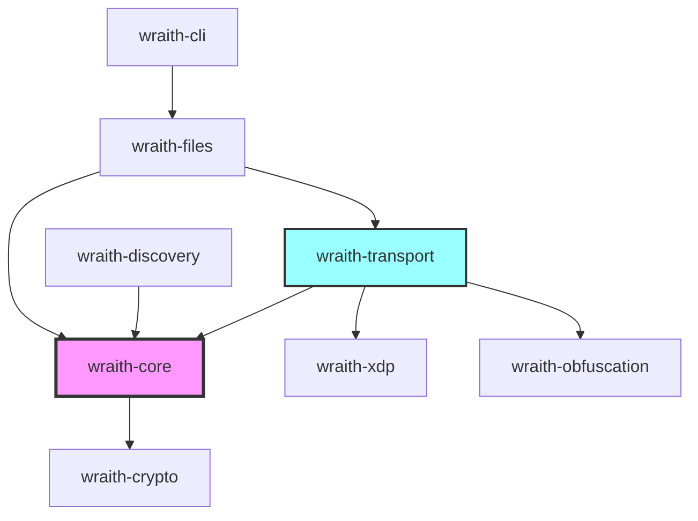

# WRAITH Protocol Development Guide

**Document Version:** 1.0.0
**Last Updated:** 2025-11-28
**Status:** Engineering Documentation

---

## Overview

This guide provides comprehensive instructions for setting up a development environment and contributing to the WRAITH Protocol. WRAITH is a high-performance, privacy-focused file transfer protocol built with Rust, leveraging kernel bypass technologies and modern cryptographic primitives.

**Prerequisites:**
- Familiarity with Rust programming
- Understanding of network protocols
- Linux system administration experience
- Basic knowledge of kernel networking (helpful but not required)

---

## System Requirements

### Operating System

**Required:**
- Linux kernel 6.2 or newer
- Distribution: Any modern Linux (Ubuntu 22.04+, Fedora 38+, Arch, etc.)

**Kernel Features Required:**
```bash
# Verify kernel version
uname -r  # Must be >= 6.2

# Check for required kernel features
zgrep -E 'CONFIG_XDP_SOCKETS|CONFIG_BPF|CONFIG_IO_URING' /proc/config.gz

# Expected output:
# CONFIG_XDP_SOCKETS=y
# CONFIG_BPF=y
# CONFIG_IO_URING=y
```

**Why Linux 6.2+?**
- AF_XDP socket improvements (zero-copy mode stability)
- io_uring enhancements (registered buffers, file operations)
- eBPF verifier improvements
- Performance optimizations for high-throughput networking

### Hardware

**Minimum:**
- CPU: 4 cores (x86_64 or aarch64)
- RAM: 8 GB
- Network: 1 Gbps NIC

**Recommended:**
- CPU: 8+ cores with AVX2/NEON SIMD
- RAM: 16 GB (32 GB for development + testing)
- Network: 10 Gbps NIC with XDP support
- Storage: NVMe SSD (for io_uring performance)

**Checking NIC XDP Support:**
```bash
# List network interfaces
ip link show

# Check if driver supports XDP
ethtool -i eth0 | grep driver

# XDP-compatible drivers: i40e, ixgbe, mlx5, virtio_net (kernel 6.2+)
```

### Software Dependencies

**Core Requirements:**
```bash
# Ubuntu/Debian
sudo apt update
sudo apt install -y \
    build-essential \
    pkg-config \
    libssl-dev \
    libbpf-dev \
    libelf-dev \
    clang \
    llvm \
    linux-headers-$(uname -r)

# Fedora/RHEL
sudo dnf install -y \
    gcc \
    pkg-config \
    openssl-devel \
    libbpf-devel \
    elfutils-libelf-devel \
    clang \
    llvm \
    kernel-devel

# Arch Linux
sudo pacman -S --needed \
    base-devel \
    openssl \
    libbpf \
    libelf \
    clang \
    llvm \
    linux-headers
```

---

## Rust Toolchain Setup

### Installing Rust

**Using rustup (recommended):**
```bash
# Install rustup
curl --proto '=https' --tlsv1.2 -sSf https://sh.rustup.rs | sh

# Configure current shell
source $HOME/.cargo/env

# Verify installation
rustc --version  # Should be 1.75.0 or newer
cargo --version
```

**Required Rust Version:**
- Minimum: Rust 1.75.0 (for async fn in traits, RPITIT)
- Recommended: Latest stable

### Toolchain Components

```bash
# Install required components
rustup component add rustfmt clippy

# Optional but recommended
rustup component add rust-src rust-analyzer

# For cross-compilation (optional)
rustup target add aarch64-unknown-linux-gnu
rustup target add x86_64-unknown-linux-musl
```

### Cargo Extensions

```bash
# Install useful cargo subcommands
cargo install cargo-watch      # Auto-rebuild on file changes
cargo install cargo-nextest    # Faster test runner
cargo install cargo-flamegraph # Performance profiling
cargo install cargo-expand     # Expand macros (debugging)
cargo install cargo-audit      # Security vulnerability scanning
cargo install cargo-udeps      # Find unused dependencies
```

---

## Project Structure

### Workspace Layout

```
WRAITH-Protocol/
├── Cargo.toml                 # Workspace manifest
├── crates/
│   ├── wraith-core/           # Core protocol logic
│   ├── wraith-crypto/         # Cryptographic primitives
│   ├── wraith-transport/      # Network transport layer
│   ├── wraith-obfuscation/    # Traffic obfuscation
│   ├── wraith-discovery/      # DHT and peer discovery
│   ├── wraith-files/          # File transfer logic
│   ├── wraith-xdp/            # XDP/eBPF packet filtering
│   └── wraith-cli/            # Command-line interface
├── xtask/                     # Build automation
├── benches/                   # Performance benchmarks
├── tests/                     # Integration tests
└── docs/                      # Documentation
```

### Crate Dependencies



**Dependency Flow:**
- **wraith-core:** Foundation layer (session management, framing)
- **wraith-crypto:** Cryptographic operations (Noise, BLAKE3, Elligator2)
- **wraith-transport:** Network I/O (AF_XDP, UDP, relay connections)
- **wraith-xdp:** Kernel bypass (XDP programs, eBPF maps)
- **wraith-obfuscation:** Traffic obfuscation (packet padding, timing randomization)
- **wraith-discovery:** Peer discovery (DHT, relay discovery)
- **wraith-files:** File transfer logic (chunking, integrity verification)
- **wraith-cli:** User interface

---

## Building from Source

### Clone Repository

```bash
# Clone the repository
git clone https://github.com/yourusername/WRAITH-Protocol.git
cd WRAITH-Protocol

# Check workspace integrity
cargo metadata --format-version=1 | jq -r '.workspace_root'
```

### Build Commands

**Debug Build (development):**
```bash
# Build all crates
cargo build

# Build specific crate
cargo build -p wraith-core

# Build with all features
cargo build --all-features

# Build documentation
cargo doc --no-deps --open
```

**Release Build (production):**
```bash
# Optimized build
cargo build --release

# Profile-guided optimization (PGO)
cargo pgo build --release

# Link-time optimization (LTO)
RUSTFLAGS="-C lto=fat" cargo build --release

# Build with CPU-specific optimizations
RUSTFLAGS="-C target-cpu=native" cargo build --release
```

**Cross-Platform Builds:**
```bash
# ARM64 (aarch64)
cargo build --target aarch64-unknown-linux-gnu --release

# Static binary (musl)
cargo build --target x86_64-unknown-linux-musl --release
```

### Build Options

**Feature Flags:**
```toml
# Available features (Cargo.toml)
[features]
default = ["af-xdp", "io-uring"]
af-xdp = []              # AF_XDP kernel bypass
io-uring = []            # io_uring file I/O
tls-relay = []           # TLS relay support
experimental = []        # Experimental features
```

**Build with specific features:**
```bash
# Minimal build (no kernel bypass)
cargo build --no-default-features

# XDP only
cargo build --no-default-features --features af-xdp

# All features
cargo build --all-features
```

---

## Running Tests

### Test Suites

**Unit Tests:**
```bash
# Run all unit tests
cargo test

# Run tests for specific crate
cargo test -p wraith-core

# Run specific test
cargo test test_noise_handshake

# Show test output
cargo test -- --nocapture

# Run tests in parallel (default) or single-threaded
cargo test -- --test-threads=1
```

**Integration Tests:**
```bash
# Run integration tests
cargo test --test '*'

# Specific integration test
cargo test --test discovery_integration

# With verbose output
cargo test --test file_transfer -- --nocapture
```

**Benchmarks:**
```bash
# Run all benchmarks
cargo bench

# Specific benchmark
cargo bench crypto_operations

# Generate flamegraph
cargo flamegraph --bench transport_bench
```

**Using cargo-nextest (faster):**
```bash
# Install nextest
cargo install cargo-nextest

# Run tests with nextest
cargo nextest run

# Run with retries (flaky test detection)
cargo nextest run --retries 3
```

### Test Requirements

**Kernel Capabilities:**
Some tests require elevated privileges for AF_XDP/XDP operations:

```bash
# Run with sudo (discouraged for most tests)
sudo -E cargo test xdp_packet_filter

# Alternative: Use setcap (preferred)
sudo setcap cap_net_raw,cap_net_admin,cap_bpf+ep target/debug/wraith-*

# Run tests
cargo test
```

**Network Tests:**
```bash
# Tests that require network access
cargo test --features network-tests

# Skip network tests
cargo test --skip network
```

### Code Coverage

```bash
# Install tarpaulin
cargo install cargo-tarpaulin

# Generate coverage report
cargo tarpaulin --out Html --output-dir coverage

# Open report
xdg-open coverage/index.html
```

---

## Development Workflow

### Hot Reloading

**Using cargo-watch:**
```bash
# Auto-rebuild on file changes
cargo watch -x build

# Auto-test on changes
cargo watch -x test

# Auto-run binary
cargo watch -x 'run -- --help'

# Clear screen between runs
cargo watch -c -x test
```

### Formatting and Linting

**Rustfmt (code formatting):**
```bash
# Format all code
cargo fmt

# Check formatting without modifying
cargo fmt -- --check

# Format specific file
rustfmt src/main.rs
```

**Clippy (linting):**
```bash
# Run Clippy
cargo clippy

# Clippy with warnings as errors
cargo clippy -- -D warnings

# Clippy with all lints
cargo clippy -- -W clippy::all -W clippy::pedantic

# Fix automatically (where possible)
cargo clippy --fix
```

**Pre-commit Checks:**
```bash
# Create pre-commit script
cat > .git/hooks/pre-commit <<'EOF'
#!/bin/bash
cargo fmt -- --check || exit 1
cargo clippy -- -D warnings || exit 1
cargo test --quiet || exit 1
EOF

chmod +x .git/hooks/pre-commit
```

### Debugging

**Using rust-gdb:**
```bash
# Build with debug symbols
cargo build

# Debug binary
rust-gdb target/debug/wraith-cli

# GDB commands:
# (gdb) break main
# (gdb) run
# (gdb) backtrace
# (gdb) print variable_name
```

**Using LLDB:**
```bash
# Build with debug symbols
cargo build

# Debug with LLDB
rust-lldb target/debug/wraith-cli

# LLDB commands:
# (lldb) breakpoint set --name main
# (lldb) run
# (lldb) thread backtrace
# (lldb) frame variable
```

**Logging:**
```rust
// Enable logging in code
use tracing::{debug, info, warn, error};

fn example() {
    debug!("Debug message");
    info!("Info message");
    warn!("Warning message");
    error!("Error message");
}
```

```bash
# Run with logging
RUST_LOG=debug cargo run

# Specific module logging
RUST_LOG=wraith_core=trace,wraith_crypto=debug cargo run

# JSON output
RUST_LOG=info cargo run -- --log-format json
```

**Performance Profiling:**
```bash
# CPU profiling with perf
cargo build --release
perf record -g target/release/wraith-cli transfer large_file.bin
perf report

# Flamegraph generation
cargo flamegraph --bin wraith-cli -- transfer large_file.bin
xdg-open flamegraph.svg

# Memory profiling with valgrind
cargo build
valgrind --leak-check=full target/debug/wraith-cli
```

---

## IDE Configuration

### Visual Studio Code

**Recommended Extensions:**
- `rust-lang.rust-analyzer` (Rust language server)
- `vadimcn.vscode-lldb` (Debugger)
- `tamasfe.even-better-toml` (TOML syntax)
- `serayuzgur.crates` (Dependency management)

**Settings (.vscode/settings.json):**
```json
{
    "rust-analyzer.cargo.features": "all",
    "rust-analyzer.checkOnSave.command": "clippy",
    "rust-analyzer.checkOnSave.extraArgs": ["--", "-D", "warnings"],
    "rust-analyzer.inlayHints.enable": true,
    "[rust]": {
        "editor.formatOnSave": true,
        "editor.defaultFormatter": "rust-lang.rust-analyzer"
    }
}
```

**Launch Configuration (.vscode/launch.json):**
```json
{
    "version": "0.2.0",
    "configurations": [
        {
            "type": "lldb",
            "request": "launch",
            "name": "Debug wraith-cli",
            "cargo": {
                "args": ["build", "--bin=wraith-cli"],
                "filter": {
                    "name": "wraith-cli",
                    "kind": "bin"
                }
            },
            "args": ["transfer", "test.bin"],
            "cwd": "${workspaceFolder}"
        }
    ]
}
```

### IntelliJ IDEA / CLion

**Plugin:** Install "Rust" plugin

**Configuration:**
1. File → Settings → Languages & Frameworks → Rust
2. Set Toolchain Location: `~/.cargo/bin`
3. Enable "External Linter": Clippy
4. Enable "Use Rustfmt instead of IntelliJ formatter"

### Helix

**Configuration (~/.config/helix/languages.toml):**
```toml
[[language]]
name = "rust"
auto-format = true
language-server = { command = "rust-analyzer" }
```

---

## Contributing Workflow

### Branch Strategy

```bash
# Create feature branch
git checkout -b feature/add-dht-caching

# Make changes
# ... edit files ...

# Commit changes
git add .
git commit -m "feat(discovery): add DHT response caching"

# Push to remote
git push origin feature/add-dht-caching

# Create pull request (via GitHub/GitLab)
```

### Commit Message Format

**Conventional Commits:**
```
<type>(<scope>): <subject>

[optional body]

[optional footer]
```

**Types:**
- `feat`: New feature
- `fix`: Bug fix
- `docs`: Documentation changes
- `refactor`: Code refactoring
- `perf`: Performance improvements
- `test`: Test additions/changes
- `chore`: Build system/dependency updates

**Examples:**
```
feat(crypto): implement Elligator2 point encoding

Add constant-time Elligator2 encoding for Curve25519 points
to provide protocol steganography capabilities.

Closes #42

fix(transport): handle ECONNRESET in AF_XDP socket

When peer disconnects abruptly, properly clean up socket state
instead of panicking.

perf(files): optimize chunk verification with SIMD

Use AVX2 BLAKE3 implementation for 3x speedup in chunk hashing.

Benchmark results:
- Before: 1.2 GB/s
- After: 3.6 GB/s
```

### Code Review Checklist

**Before Submitting:**
- [ ] Code compiles without warnings (`cargo build`)
- [ ] All tests pass (`cargo test`)
- [ ] Clippy passes (`cargo clippy -- -D warnings`)
- [ ] Code is formatted (`cargo fmt`)
- [ ] Documentation updated (if public API changed)
- [ ] Benchmarks run (if performance-critical code)
- [ ] CHANGELOG.md updated

**Pull Request Template:**
```markdown
## Description
Brief description of changes

## Motivation
Why is this change necessary?

## Changes
- List of specific changes
- Another change

## Testing
How was this tested?

## Performance Impact
Any performance implications?

## Checklist
- [ ] Tests added/updated
- [ ] Documentation updated
- [ ] CHANGELOG.md updated
```

---

## Environment Variables

### Build-Time Variables

```bash
# Optimization level
export CARGO_PROFILE_RELEASE_OPT_LEVEL=3

# LTO (Link-Time Optimization)
export CARGO_PROFILE_RELEASE_LTO=true

# Strip symbols
export CARGO_PROFILE_RELEASE_STRIP=true

# Target CPU features
export RUSTFLAGS="-C target-cpu=native"
```

### Runtime Variables

```bash
# Logging level
export RUST_LOG=info

# Backtrace on panic
export RUST_BACKTRACE=1

# Thread count (for rayon)
export RAYON_NUM_THREADS=8

# Custom configuration
export WRAITH_CONFIG=/path/to/config.toml
```

---

## Common Tasks

### Adding a New Crate

```bash
# Create new crate in workspace
cargo new --lib crates/wraith-newcrate

# Add to workspace Cargo.toml
# [workspace]
# members = [
#     "crates/wraith-newcrate",
#     ...
# ]

# Add dependency in another crate
# [dependencies]
# wraith-newcrate = { path = "../wraith-newcrate" }
```

### Updating Dependencies

```bash
# Check for outdated dependencies
cargo outdated

# Update dependencies (respecting Cargo.toml constraints)
cargo update

# Update specific dependency
cargo update -p tokio

# Upgrade to latest versions (breaking changes)
cargo upgrade
```

### Performance Profiling

```bash
# CPU profiling
cargo build --release
perf record -g target/release/wraith-cli transfer test.bin
perf report

# Memory profiling
valgrind --tool=massif target/release/wraith-cli transfer test.bin
ms_print massif.out.* | less

# Heap profiling
cargo build --release
heaptrack target/release/wraith-cli transfer test.bin
heaptrack_gui heaptrack.wraith-cli.*.gz
```

---

## Troubleshooting

### Build Errors

**Issue: "cannot find -lbpf"**
```bash
# Install libbpf
sudo apt install libbpf-dev  # Ubuntu
sudo dnf install libbpf-devel  # Fedora
```

**Issue: "failed to run custom build command for `openssl-sys`"**
```bash
# Install OpenSSL development files
sudo apt install libssl-dev pkg-config
```

**Issue: "linker `cc` not found"**
```bash
# Install build essentials
sudo apt install build-essential
```

### Runtime Errors

**Issue: "Operation not permitted" (XDP socket creation)**
```bash
# Grant capabilities
sudo setcap cap_net_raw,cap_net_admin,cap_bpf+ep target/debug/wraith-cli

# Or run with sudo (not recommended)
sudo target/debug/wraith-cli
```

**Issue: "Address already in use"**
```bash
# Find process using port
sudo lsof -i :41641

# Kill process
sudo kill -9 <PID>
```

### Test Failures

**Issue: Flaky network tests**
```bash
# Run with retries
cargo nextest run --retries 3

# Increase timeout
cargo test -- --test-threads=1 --nocapture
```

**Issue: Slow tests**
```bash
# Run only fast tests
cargo test --lib

# Skip slow integration tests
cargo test --skip slow_integration
```

---

## Additional Resources

### Documentation

- **Internal Docs:** `cargo doc --open`
- **Architecture:** `docs/architecture/`
- **API Reference:** `docs/engineering/api-reference.md`
- **Coding Standards:** `docs/engineering/coding-standards.md`

### Community

- **GitHub Issues:** Report bugs, request features
- **Discussions:** Design discussions, Q&A
- **Discord/Matrix:** Real-time chat (if available)

### External Resources

- [Rust Book](https://doc.rust-lang.org/book/)
- [Rustonomicon](https://doc.rust-lang.org/nomicon/) (unsafe Rust)
- [AF_XDP Documentation](https://www.kernel.org/doc/html/latest/networking/af_xdp.html)
- [io_uring Documentation](https://kernel.dk/io_uring.pdf)
- [Noise Protocol Framework](https://noiseprotocol.org/noise.html)

---

## Next Steps

1. **Set up environment:** Install dependencies, Rust toolchain
2. **Build project:** `cargo build`
3. **Run tests:** `cargo test`
4. **Read architecture docs:** Understand protocol design
5. **Pick an issue:** Find "good first issue" label
6. **Make changes:** Follow coding standards
7. **Submit PR:** Create pull request for review

---

**See Also:**
- [Coding Standards](coding-standards.md)
- [API Reference](api-reference.md)
- [Dependency Management](dependency-management.md)
- [Testing Strategy](../testing/testing-strategy.md)
