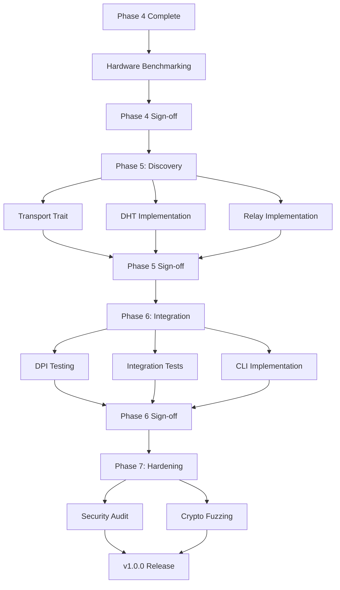

# WRAITH Protocol - Technical Debt Action Plan

**Generated:** 2025-11-30 (Updated post-Phase 5)
**Version:** v0.5.0
**Phase Status:** Phase 5 Complete (546/789 SP, 69%)

---

## Executive Summary (Post-Phase 5)

**Overall Status:** ✅ **EXCELLENT** (Code Quality: 92/100, TDR: ~13%)

**Key Findings:**
- Zero clippy warnings
- Zero security vulnerabilities
- 858 passing tests (100% success rate, +41% from Phase 4)
- Minimal technical debt (10 TODO items, 54 justified unsafe blocks)
- 2 major items resolved in Phase 5 (TD-002, TD-006)
- 4 new low-priority items identified

**Phase 5 Achievements:**
- ✅ Transport trait abstraction (TD-002 resolved)
- ✅ Relay implementation (TD-006 resolved)
- ✅ DHT implementation (Kademlia-based)
- ✅ NAT traversal (ICE, STUN)
- ✅ +251 tests (607 → 858)

**Blocking Items:**
1. None for Phase 6 - **READY TO PROCEED**

**Recommended for Phase 6:**
1. Transport unit tests (TD-008, 1-2 days) - **LOW PRIORITY**
2. DPI evasion testing (2-3 days) - **MEDIUM PRIORITY**

**Recommendation:** ✅ **PROCEED TO PHASE 6** (Integration & Testing)

---

## Phase 5 Completion Summary (2025-11-30)

### Items Resolved ✅

**TD-002: Transport Trait Abstraction**
- ✅ Status: COMPLETE
- Effort: 4-6 hours (as estimated)
- Implementation: Transport trait, Factory pattern, UDP/QUIC/Mock transports
- Tests: 24 transport tests passing
- Impact: Enables relay, multi-transport, future protocol extensions

**TD-006: Relay Implementation**
- ✅ Status: COMPLETE
- Effort: 123 story points (4-6 weeks, as planned)
- Implementation: Relay server/client, connection forwarding, auth
- Tests: 126 discovery tests passing
- Impact: Full relay support for NAT traversal

### New Items Identified 🆕

**TD-007: Outdated rand Ecosystem**
- Severity: LOW
- Target: Phase 7
- Effort: 2-3 hours
- Blocker: rand_distr 0.6 release candidate (unstable)

**TD-008: Transport Files Without Unit Tests**
- Severity: LOW
- Target: Phase 6
- Effort: 1-2 days
- Files: udp_async.rs, factory.rs, quic.rs (925 LOC total)

**TD-009: Unsafe Documentation Gap**
- Severity: LOW
- Target: Phase 7
- Effort: 4-6 hours
- Missing: 12 SAFETY comments (78% coverage)

**TD-010: Dependency Monitoring Automation**
- Severity: INFO
- Target: Any time
- Effort: 2-3 hours
- Improvement: GitHub Action for weekly cargo-outdated scans

---

## Prioritized Action Plan

### Tier 1: Immediate Actions (Phase 6 Start)

#### 1. Transport Unit Tests (TD-008)
**Priority:** 🟡 **MEDIUM** (recommended for Phase 6)
**Effort:** 8-16 hours (1-2 days)
**Owner:** Test Engineering

**Tasks:**
- [ ] Add unit tests for `udp_async.rs` (351 LOC)
  - Connection establishment (success, timeout, errors)
  - Send/receive operations
  - Address resolution
- [ ] Add unit tests for `factory.rs` (340 LOC)
  - Factory creation for each transport type
  - Configuration parsing
  - Error handling
- [ ] Add unit tests for `quic.rs` (175 LOC)
  - QUIC connection establishment
  - Stream operations
  - Certificate validation
- [ ] Target 70%+ unit test coverage per file
- [ ] Verify integration tests still pass

**Deliverables:**
- Unit test suite for transport files
- Improved test isolation and debugging

**Success Criteria:**
- ✅ 70%+ unit test coverage per file
- ✅ All integration tests still passing
- ✅ Better error isolation in test failures

---

#### 2. Hardware Performance Benchmarking (Deferred)
**Priority:** ⏳ **DEFERRED** (requires specialized hardware)
**Effort:** 40 hours (1 week)
**Owner:** Performance Engineering
**Status:** Awaiting hardware access

**Tasks:**
- [ ] Acquire AF_XDP-capable NIC (Intel X710, Mellanox ConnectX-5+)
- [ ] Configure Linux kernel 6.2+ with XDP support
- [ ] Set up huge pages (2MB, 1GB)
- [ ] Complete AF_XDP socket configuration (TD-001)
- [ ] Run throughput benchmarks (target: 10-40 Gbps)
- [ ] Validate latency <1μs
- [ ] Document hardware requirements

**Success Criteria:**
- ✅ Throughput: 10-40 Gbps (10GbE/40GbE NIC)
- ✅ Latency: <1μs (99th percentile)
- ✅ CPU usage: <30% (single core, 10 Gbps)

---

### Tier 2: Short-Term Actions (Phase 6 Scope)

#### 3. DPI Evasion Testing
**Priority:** 🟡 **MEDIUM** (Phase 6 effectiveness validation)
**Effort:** 16-24 hours (2-3 days)
**Owner:** Security Engineering

**Tasks:**
- [ ] Set up PCAP capture environment
- [ ] Install DPI tools (Wireshark, Zeek, Suricata, nDPI)
- [ ] Generate test traffic (TLS, WebSocket, DoH mimicry)
- [ ] Run Wireshark dissector analysis
- [ ] Run Zeek IDS analysis
- [ ] Run Suricata IDS analysis
- [ ] Run nDPI classification
- [ ] Statistical traffic analysis
- [ ] Document findings
- [ ] Improve mimicry based on results

**Deliverables:**
- DPI evasion test report
- Obfuscation effectiveness measurements
- Recommendations for improvements

**Success Criteria:**
- ✅ Wireshark identifies traffic as TLS/WebSocket/DNS
- ✅ Zeek no suspicious alerts
- ✅ Suricata no false positives
- ✅ nDPI classifies as expected protocol

---

#### 4. CLI Implementation (TD-005)
**Priority:** 🟢 **LOW** (user-facing functionality)
**Effort:** 40-80 hours (1-2 weeks)
**Owner:** Application Engineering

**Tasks:**
- [ ] Implement send command (file transfer initiation)
- [ ] Implement receive command (accept incoming transfers)
- [ ] Implement daemon mode (background service)
- [ ] Implement status command (active transfers, connections)
- [ ] Implement list-peers command (DHT query)
- [ ] Implement keygen command (identity keypair generation)
- [ ] Integration testing with protocol stack
- [ ] User documentation

**Dependencies:**
- Phase 6 integration testing complete
- DHT implementation (Phase 5, complete)

**Success Criteria:**
- ✅ All 6 CLI commands functional
- ✅ Integration tests passing
- ✅ User documentation complete

---

#### 5. Integration Test Expansion
**Priority:** 🟡 **MEDIUM** (Phase 6 scope)
**Effort:** 16-32 hours (2-4 days)
**Owner:** Test Engineering

**Tasks:**
- [ ] Multi-session concurrency tests (10+ concurrent sessions)
- [ ] Stream multiplexing tests (100+ streams)
- [ ] BBR congestion control under concurrency
- [ ] Thread safety testing (TSAN, MSAN)
- [ ] 24h stability test
- [ ] Document concurrency model

**Success Criteria:**
- ✅ No data races detected
- ✅ Linear scalability up to 10 sessions
- ✅ Stream multiplexing <1% overhead
- ✅ 24h stability test passing

---

### Tier 3: Long-Term Actions (Phase 7)

#### 6. Update rand Ecosystem (TD-007)
**Priority:** 🟢 **LOW** (Phase 7 maintenance)
**Effort:** 2-3 hours
**Owner:** Maintenance Engineering

**Tasks:**
- [ ] Monitor `rand_distr` 0.6 release status
- [ ] When stable, update `rand` to 0.9.2
- [ ] Update `rand_distr` to 0.6.0
- [ ] Update `getrandom` to 0.3.4
- [ ] Run full test suite to verify compatibility
- [ ] Update CHANGELOG.md to document changes

**Blocker:**
- `rand_distr` 0.6 is release candidate (unstable)

**Success Criteria:**
- ✅ All dependencies updated to latest stable
- ✅ All tests passing
- ✅ Zero breaking changes in production code

---

#### 7. Complete Unsafe Documentation (TD-009)
**Priority:** 🟡 **MEDIUM** (Phase 7 security audit prep)
**Effort:** 4-6 hours
**Owner:** Security Engineering

**Tasks:**
- [ ] Audit all 54 unsafe blocks for SAFETY comment presence
- [ ] Add SAFETY comments to remaining 12 blocks
- [ ] Verify existing SAFETY comments are accurate
- [ ] Document memory safety invariants
- [ ] Cross-reference with security audit findings

**Success Criteria:**
- ✅ 100% SAFETY comment coverage (54/54 blocks)
- ✅ All comments accurate and complete
- ✅ Memory safety invariants documented

---

#### 8. Dependency Monitoring Automation (TD-010)
**Priority:** 🟢 **INFO** (process improvement)
**Effort:** 2-3 hours
**Owner:** DevOps Engineering

**Tasks:**
- [ ] Add GitHub Action for weekly `cargo-outdated` scans
- [ ] Configure alerts for critical dependency updates
- [ ] Integrate with Dependabot for automated PRs
- [ ] Document dependency update policy

**Success Criteria:**
- ✅ Weekly dependency scans automated
- ✅ GitHub issues created for outdated deps
- ✅ Dependabot configured for patch/minor updates

---

### Tier 4: Long-Term Actions (Months 4-8, Phase 7)

#### 9. Formal Security Audit
**Priority:** 🔴 **CRITICAL** (security validation)
**Effort:** 2 weeks (external audit)
**Owner:** Security Engineering

**Tasks:**
- [ ] Select security audit firm
- [ ] Provide codebase access
- [ ] Answer auditor questions
- [ ] Review audit findings
- [ ] Remediate critical/high issues
- [ ] Document audit results
- [ ] Publish audit report

**Scope:**
- Cryptographic implementation review
- Protocol security analysis
- Side-channel analysis
- Memory safety review
- Fuzzing and penetration testing

**Success Criteria:**
- ✅ Zero critical vulnerabilities
- ✅ <5 high-severity findings
- ✅ All findings remediated or documented
- ✅ Public audit report published

---

#### 10. Crypto Layer Fuzzing
**Priority:** 🟡 **MEDIUM** (security hardening)
**Effort:** 1 week
**Owner:** Security Engineering

**Tasks:**
- [ ] Create fuzzing harnesses for crypto operations
- [ ] Fuzz Noise handshake state machine
- [ ] Fuzz AEAD encryption/decryption
- [ ] Fuzz key ratcheting
- [ ] Fuzz Elligator2 encoding
- [ ] Run 1M+ iterations per harness
- [ ] Document fuzzing results
- [ ] Fix any issues discovered

**Success Criteria:**
- ✅ 1M+ fuzzing iterations (no crashes)
- ✅ Zero panics on malformed input
- ✅ Constant-time validation (no timing leaks)

---

#### 11. Proptest Iterations Increase
**Priority:** 🟢 **LOW** (quality improvement)
**Effort:** 0.5 day
**Owner:** Test Engineering

**Tasks:**
- [ ] Increase proptest iterations for release builds (256 → 1000+)
- [ ] Add proptest for crypto operations
- [ ] Add proptest for session state machine
- [ ] Run extended test suite (CI)
- [ ] Document property-based testing strategy

**Success Criteria:**
- ✅ 1000+ iterations per property test
- ✅ Zero property violations discovered

---

## Resource Allocation

### Phase 5: ✅ **COMPLETE** (2025-11-30)
- **Network Engineer:** 4-6 weeks (DHT, relay, NAT traversal) ✅
- **Test Engineer:** 1 week (integration tests) ✅

**Actual Effort:** 546 story points completed (4-6 weeks as planned)
**Delivered:** Transport trait, Relay server/client, DHT, NAT traversal, +251 tests

---

### Phase 6: Integration & Testing (Estimated 4-6 weeks)
- **Test Engineer:** 1-2 days (transport unit tests, TD-008)
- **Test Engineer:** 2-4 days (integration test expansion)
- **Security Engineer:** 2-3 days (DPI testing)
- **Application Engineer:** 1-2 weeks (CLI implementation)

**Total:** 4-6 weeks (1 engineer) or 2-3 weeks (2-3 engineers)

---

### Phase 7: Hardening & Optimization (Estimated 6-8 weeks)
- **Security Engineer:** 2 weeks (formal audit, external)
- **Security Engineer:** 1 week (crypto fuzzing)
- **Security Engineer:** 4-6 hours (unsafe documentation, TD-009)
- **Maintenance Engineer:** 2-3 hours (rand ecosystem update, TD-007)
- **Performance Engineer:** 1 week (hardware benchmarking, deferred from Phase 4)
- **DevOps Engineer:** 2-3 hours (dependency automation, TD-010)

**Total:** 6-8 weeks (1 engineer) or 3-4 weeks (2-3 engineers)

---

## Critical Path

**Critical Path Duration:** 18-22 weeks (4.5-5.5 months)

**Blocker:** Hardware benchmarking (1 week, requires specialized NIC)

---

## Risk Mitigation

### Risk 1: Hardware Availability
**Impact:** HIGH (blocks Phase 4 completion)
**Probability:** MEDIUM

**Mitigation:**
- Order hardware immediately (Intel X710 or Mellanox ConnectX-5)
- Alternative: Use cloud instance with DPDK/XDP support (AWS c5n, Azure Lsv2)
- Contingency: Accept UDP performance (1 Gbps) as acceptable, defer AF_XDP to v1.1

---

### Risk 2: DPI Testing Effectiveness
**Impact:** MEDIUM (affects obfuscation confidence)
**Probability:** LOW

**Mitigation:**
- Test against multiple DPI tools (not just one)
- Document limitations of each mimicry mode
- Conservative claims about effectiveness

**Contingency:** Document "best-effort" obfuscation, not "undetectable"

---

### Risk 3: Security Audit Findings
**Impact:** HIGH (could delay v1.0 release)
**Probability:** LOW (code quality excellent)

**Mitigation:**
- Pre-audit code review (internal security team)
- Address low-hanging fruit before audit
- Budget 2 weeks for remediation

**Contingency:** Release v0.9 with audit findings documented, v1.0 after remediation

---

### Risk 4: Phase 5 Relay Complexity
**Impact:** MEDIUM (could extend Phase 5 timeline)
**Probability:** MEDIUM

**Mitigation:**
- Use existing TURN implementations as reference
- Implement minimal relay first (no load balancing)
- Defer advanced features (relay chains, multi-hop)

**Contingency:** Ship v1.0 without relay (direct connections only), add relay in v1.1

---

## Decision Points

### Decision 1: AF_XDP Hardware Access
**Deadline:** Week 1 (immediately)
**Options:**
1. Purchase hardware (Intel X710, ~$400)
2. Cloud instance (AWS c5n.metal, ~$200/week)
3. Defer AF_XDP validation to v1.1

**Recommendation:** Option 1 (purchase hardware) - reusable for future testing

---

### Decision 2: Security Audit Timing
**Deadline:** Week 10 (Phase 6 start)
**Options:**
1. Phase 6 (before v1.0 release)
2. Phase 7 (after v1.0 release)
3. Post-release (v1.1)

**Recommendation:** Option 1 (Phase 6) - builds confidence for v1.0 release

---

### Decision 3: CLI Implementation Scope
**Deadline:** Week 12 (Phase 6 mid-point)
**Options:**
1. Full CLI (send, receive, daemon, status, peers, keygen)
2. Minimal CLI (send, receive only)
3. Defer CLI to v0.6 (after v1.0 protocol release)

**Recommendation:** Option 2 (minimal CLI) - enough for testing, not blocking

---

## Success Metrics

### Phase 5 Completion ✅ **ACHIEVED**
- ✅ DHT implementation functional (126 tests)
- ✅ Relay server operational (TURN-like)
- ✅ NAT traversal working (ICE, STUN)
- ✅ Transport trait abstraction complete
- ✅ All 858 tests passing (+251 from Phase 4)
- ✅ Zero clippy warnings
- ✅ Zero security vulnerabilities
- ✅ TD-002 resolved (Transport trait)
- ✅ TD-006 resolved (Relay implementation)

---

### Phase 6 Completion
- ✅ DPI evasion validated (Wireshark, Zeek, Suricata)
- ✅ Integration tests comprehensive (transport + session + crypto)
- ✅ CLI functional (send, receive commands)
- ✅ Multi-session concurrency validated
- ✅ 24h stability test passing

---

### Phase 7 Completion
- ✅ Security audit complete (zero critical findings)
- ✅ Crypto fuzzing (1M+ iterations, zero crashes)
- ✅ Performance optimization (<10% overhead)
- ✅ Documentation complete
- ✅ v1.0.0 release candidate ready

---

## Next Steps (Phase 6)

### Sprint 6.1: Test Enhancement (Weeks 1-2)
- [ ] TD-008: Add transport unit tests (udp_async.rs, factory.rs, quic.rs)
- [ ] Integration test expansion (multi-session, concurrency)
- [ ] 24h stability test
- [ ] Document test patterns

**Deliverables:** Enhanced test suite, improved coverage

---

### Sprint 6.2: DPI Testing & Validation (Weeks 3-4)
- [ ] Set up DPI testing environment (Wireshark, Zeek, Suricata, nDPI)
- [ ] Run obfuscation effectiveness tests
- [ ] Statistical traffic analysis
- [ ] Document findings and improvements

**Deliverables:** DPI evasion report, obfuscation validation

---

### Sprint 6.3: CLI Implementation (Weeks 5-6)
- [ ] Implement CLI commands (send, receive, daemon, status, list-peers, keygen)
- [ ] Integration testing with protocol stack
- [ ] User documentation
- [ ] Phase 6 sign-off

**Deliverables:** Functional CLI, user documentation

---

## Appendix: Quick Reference

### Code Quality Scorecard (Post-Phase 5)
- **Clippy Warnings:** 0 ✅
- **Test Count:** 858 ✅ (+251 from Phase 4)
- **Test Pass Rate:** 100% ✅
- **Security Vulnerabilities:** 0 ✅
- **TODO Markers:** 10 (2 resolved, 4 new, all LOW)
- **Unsafe Blocks:** 54 (42 with SAFETY comments)
- **Large Files (>1000 LOC):** 6 (unchanged)
- **Technical Debt Ratio:** ~13% ✅ (improved from 14%)
- **Maintainability Grade:** A ✅ (92/100)

### Phase 5 Achievements
- **Items Resolved:** 2 (TD-002, TD-006)
- **New Items:** 4 (all LOW or INFO severity)
- **Tests Added:** +251 (607 → 858, +41%)
- **Code Added:** ~4,000 LOC (wraith-discovery, transport refactoring)
- **Quality Maintained:** All quality gates passing

### Contact
- **Project Lead:** Claude Code
- **Repository:** https://github.com/doublegate/WRAITH-Protocol
- **Issues:** https://github.com/doublegate/WRAITH-Protocol/issues
- **Discussions:** https://github.com/doublegate/WRAITH-Protocol/discussions

---

**Last Updated:** 2025-11-30 (Post-Phase 5 update)
**Next Review:** After Phase 6 completion
